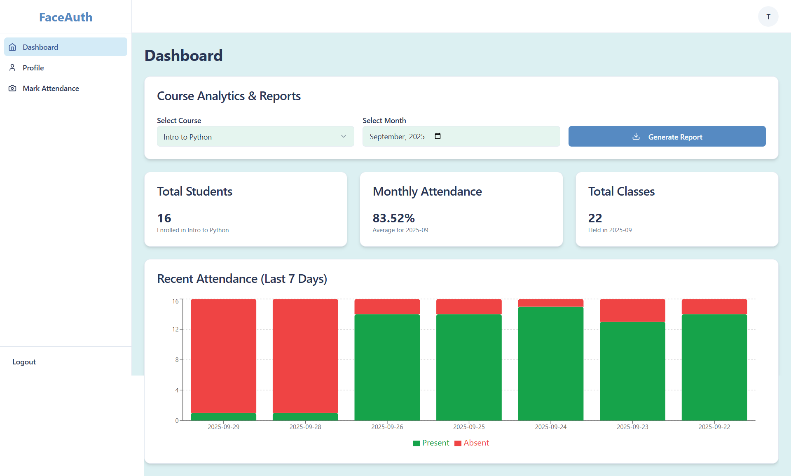
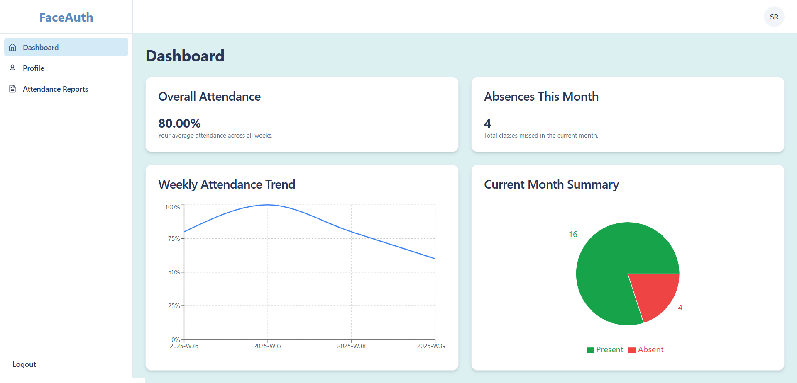

# Faceauth automated attendance System

## Overview

This project is a full-stack web application for managing student information. It features a modern user interface built with **Next.js (React)** and a robust REST API powered by **Flask (Python)** to handle data processing and database interactions.

## Preview

Admin Dashboard 

 
Teacher Dashboard

 
Student Dashboard



## Project Structure

The repository is organized into two main directories, separating the frontend and backend concerns:

## Prerequisites

Before you begin, ensure you have the following installed on your system:
* **Node.js** (v18 or later)
* **npm** or **yarn**
* **Python** (v3.8 or later)
* **pip**

---

## Backend Setup (Flask API)

Follow these steps to get the backend server running.

1.  **Navigate to the backend directory:**
    ```bash
    cd backend
    ```

2.  **Create and activate a Python virtual environment:(optinal)**
    * **Windows:**
        ```bash
        python -m venv venv
        .\venv\Scripts\activate
        ```
    * **macOS / Linux:**
        ```bash
        python3 -m venv venv
        source venv/bin/activate
        ```

3.  **Install dependencies:**
    The required Python packages are listed in `requirements.txt`.
    ```bash
    pip install -r requirements.txt
    ```

4.  **Configure environment variables:**
    Create a new file named `.env` in the `backend` directory. Which will include your MONGO_URI and the JWT_SECRET_KEY

    ```bash
    MONGO_URI="your mongo url"
    JWT_SECRET_KEY="your jwt secret key"
    ```


5.  **Seed the database:**
    Run the seed script to create the email and password for the admin and teacher role.
    ```bash
    python seed_db.py
    ```

    (optinal)Populate the databse with mock data for testing. 
    ```bash
    python full_mock_data_generator.py
    ```

6.  **Run the backend server:**
    ```bash
    python run.py
    ```
    ✅ The backend API should now be running on **`http://127.0.0.1:5000`**.

---

## Frontend Setup (Next.js App)

Follow these steps to get the user interface running.

1.  **Navigate to the frontend directory from the root:**
    ```bash
    cd frontend
    ```

2.  **Install dependencies:**
    Using npm:
    ```bash
    npm install
    ```
    *or* using yarn:
    ```bash
    yarn install
    ```

3.  **Run the frontend development server:**
    Using npm:
    ```bash
    npm run dev
    ```
    *or* using yarn:
    ```bash
    yarn dev
    ```
    ✅ The application should now be running on **`http://localhost:3000`**.

---

## Usage

With both the backend and frontend servers running, open your web browser and navigate to `http://localhost:3000`. The frontend application will load and make API calls to your backend server to fetch and display data.
